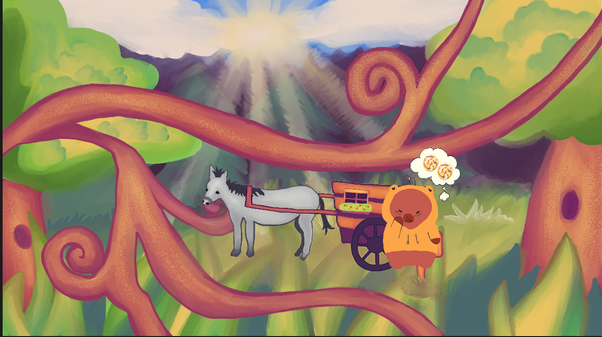

# Papa's Arepitas

Papa's Arepitas is a game that is based on Papa's Pizzeria, but with arepas instead of pizza. The player must knead their dough to a large enough size and then cook it on the steel palm pans.

## Assets Sourcing

Most assets here were taken from Macondo, including the title screen. Some were modified a bit to better fit the game. The other assets were created by Bennett.

## Instructions
1. Press start
2. Click on the wagon to go inside
3. Click on the big arepa to get a new arepa
4. Drag the arepa from the corner onto the wooden board (that says "explora")
5. Drag the edges of the arepa outwards to roll it out
6. Once it is big enough, you will no longer be able to roll it and you can drag it out
7. Drag it to one of the steel palm pans to heat it up
8. You can click on the pan/arepa to flip the arepa
9. Cook the sides without burning them (which happens when the timer runs out)

